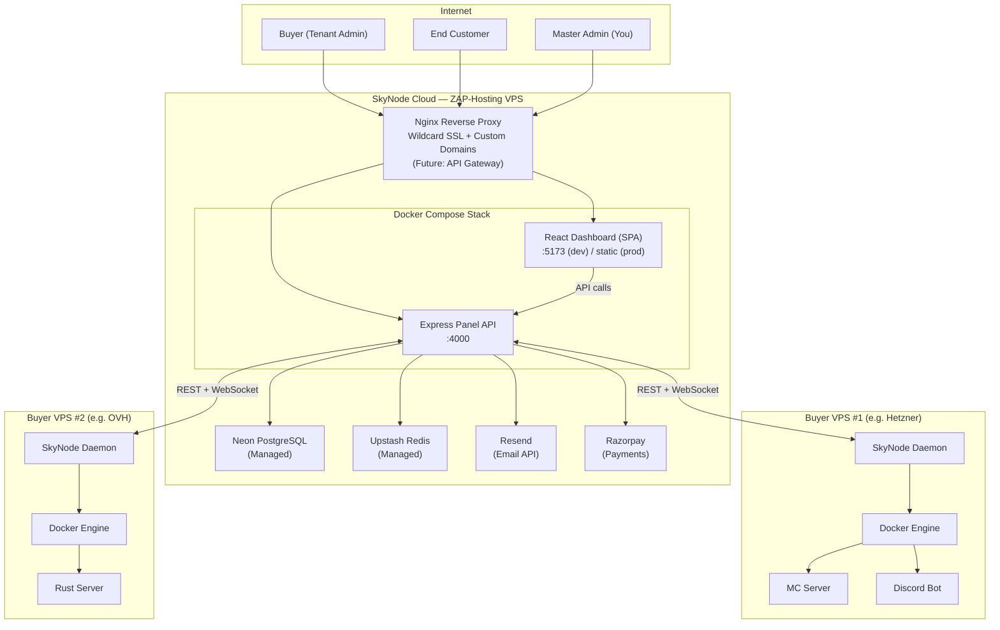
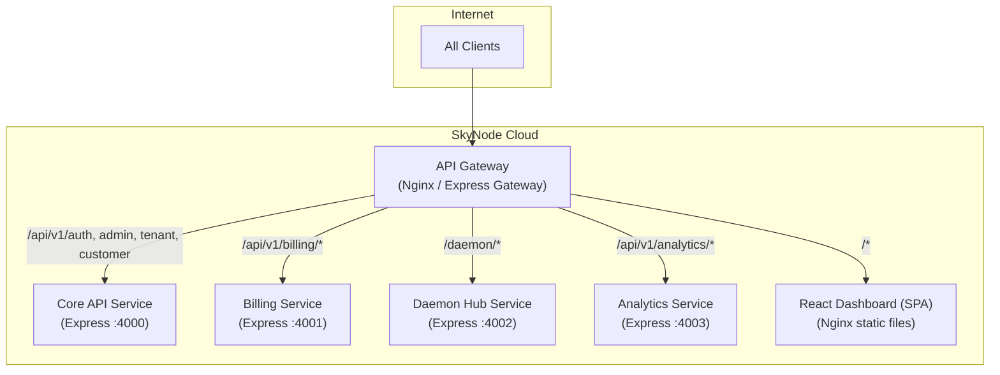
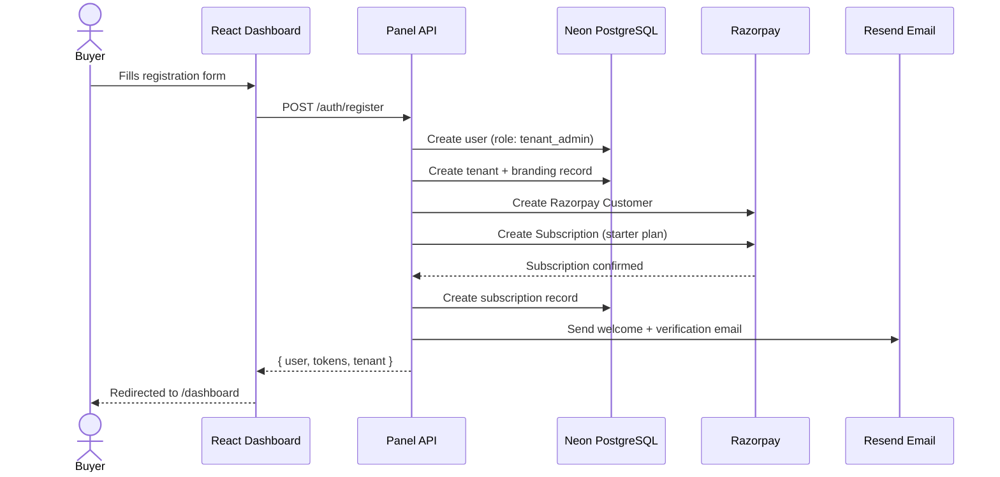
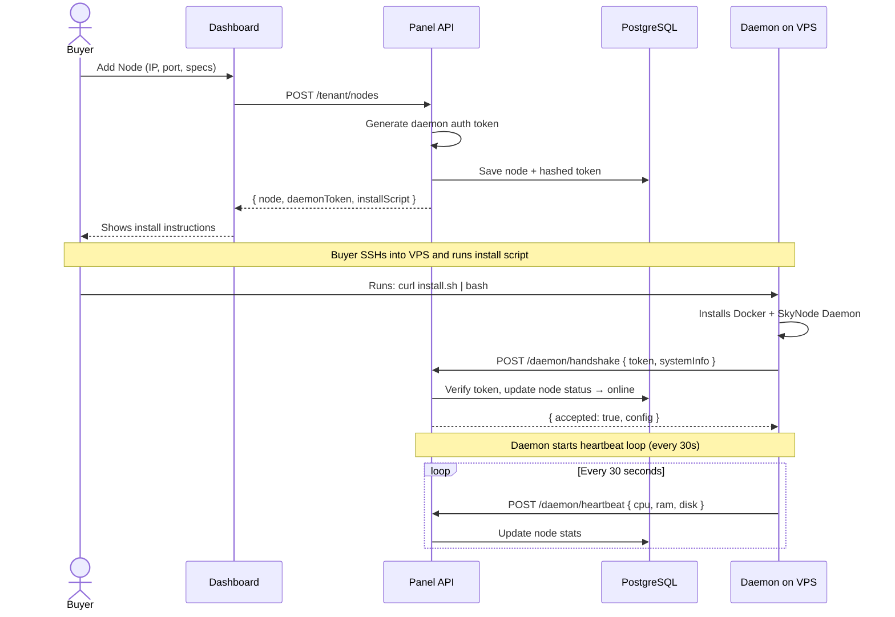
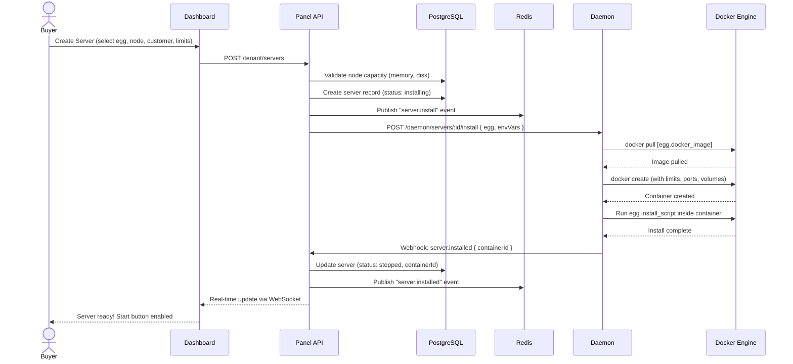
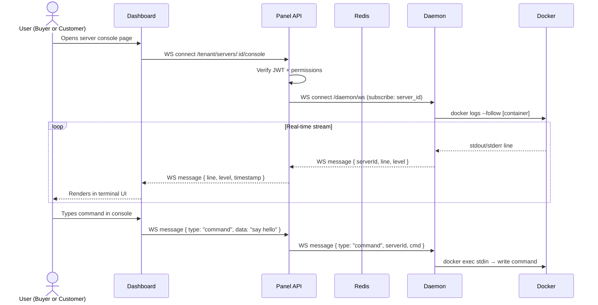
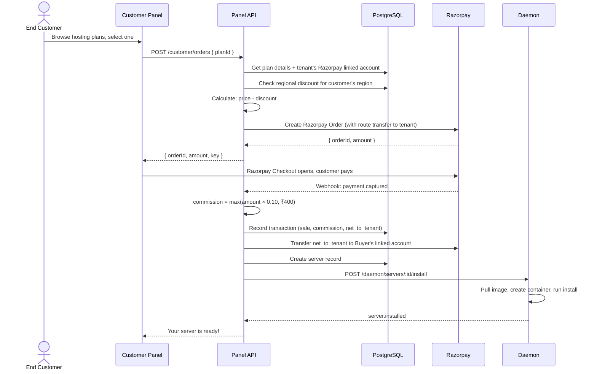
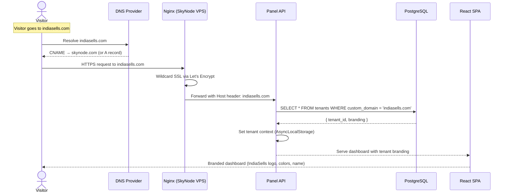
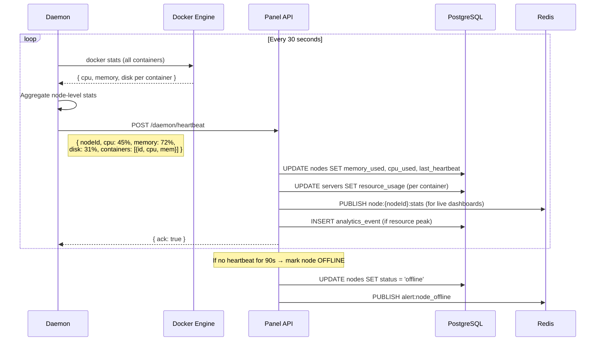

# SkyNode — Architecture & Information Flow

## High-Level Architecture



---

## Gateway-Ready Architecture (Phase 3 Future)



> **Key insight:** Each module is already an Express Router. Extraction = wrap the router in `express().listen()` + update the gateway config. Zero business logic changes.

---

## Information Flow — Every Major Operation

### Flow 1: Buyer Registration & Onboarding



### Flow 2: Buyer Adds a VPS Node



### Flow 3: Creating a Game Server



### Flow 4: Console Streaming (Real-Time)



### Flow 5: End Customer Purchases a Server



### Flow 6: Custom Domain Resolution



### Flow 7: Daemon Heartbeat & Monitoring



---

## Data Flow Summary

```
┌─────────────────────────────────────────────────────────────────┐
│                        INTERNET LAYER                          │
│  Buyers / Customers / Admin → Nginx (SSL termination)          │
└──────────────────────────┬──────────────────────────────────────┘
                           │
┌──────────────────────────▼──────────────────────────────────────┐
│                      APPLICATION LAYER                          │
│                                                                 │
│  React SPA (Vite)        ←→  Express API                      │
│  • Client-side rendering       • Auth (JWT + RBAC)             │
│  • Tenant-branded UI            • Tenant context isolation     │
│  • Real-time console            • Business logic               │
│  • File manager                 • Commission engine            │
│                                 • WebSocket hub (ws)           │
│                                                                 │
│  Gateway-Ready: Each Express Router = potential microservice   │
└────────────┬────────────────────────┬───────────────────────────┘
             │                        │
┌────────────▼────────┐  ┌────────────▼───────────────────────────┐
│    DATA LAYER       │  │         EXTERNAL SERVICES              │
│                     │  │                                        │
│  Neon PostgreSQL    │  │  Razorpay       → Payments             │
│  • 17 tables        │  │  Resend          → Emails              │
│  • RLS policies     │  │  Upstash Redis   → Cache/PubSub       │
│  • Analytics data   │  │                                        │
└─────────────────────┘  └────────────────────────────────────────┘
                           │
┌──────────────────────────▼──────────────────────────────────────┐
│                    INFRASTRUCTURE LAYER                          │
│                                                                 │
│  Buyer VPS #1          Buyer VPS #2          Buyer VPS #N       │
│  ┌──────────────┐      ┌──────────────┐      ┌──────────────┐  │
│  │ SkyNode      │      │ SkyNode      │      │ SkyNode      │  │
│  │ Daemon       │      │ Daemon       │      │ Daemon       │  │
│  │   ↕ REST/WS  │      │   ↕ REST/WS  │      │   ↕ REST/WS  │  │
│  │ Docker       │      │ Docker       │      │ Docker       │  │
│  │  ├─ Server 1 │      │  ├─ Server 3 │      │  ├─ Server N │  │
│  │  └─ Server 2 │      │  └─ Server 4 │      │  └─ ...      │  │
│  └──────────────┘      └──────────────┘      └──────────────┘  │
└─────────────────────────────────────────────────────────────────┘
```
