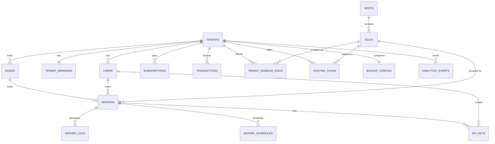

# SkyNode — Database Schema

## Overview

- **17 collections** across 6 domains
- **MongoDB Atlas**
- **Tenant isolation** via `tenantId` field and global Mongoose plugin
- **ObjectIds** for all primary keys

---

## Entity Relationship Diagram



---

## Collections & Mongoose Schemas

### 1. `tenants`

The Buyers — companies/individuals who purchase a SkyNode subscription.

```typescript
const TenantSchema = new Schema({
    name: { type: String, required: true },
    slug: { type: String, required: true, unique: true }, // used for subdomain: slug.skynode.com
    customDomain: { type: String, unique: true, sparse: true },
    domainVerified: { type: Boolean, default: false },
    ownerEmail: { type: String, required: true },
    plan: { type: String, enum: ['starter', 'pro', 'enterprise'], default: 'starter' },
    status: { type: String, enum: ['active', 'suspended', 'cancelled'], default: 'active' },
    region: { type: String }, // ISO country code
    settings: { type: Schema.Types.Mixed, default: {} }
}, { timestamps: true });
```

---

### 2. `tenant_brandings`

White-label customization for each tenant.

```typescript
const TenantBrandingSchema = new Schema({
    tenantId: { type: Schema.Types.ObjectId, ref: 'Tenant', required: true, unique: true },
    companyName: { type: String },
    logoUrl: { type: String },
    iconUrl: { type: String },
    primaryColor: { type: String, default: '#6366f1' },
    secondaryColor: { type: String, default: '#8b5cf6' },
    supportEmail: { type: String },
    customCss: { type: String }
}, { timestamps: true });
```

---

### 3. `users`

All users across all roles.

```typescript
const UserSchema = new Schema({
    tenantId: { type: Schema.Types.ObjectId, ref: 'Tenant' }, // null for master_admin
    email: { type: String, required: true },
    passwordHash: { type: String, required: true },
    name: { type: String, required: true },
    role: { type: String, enum: ['master_admin', 'tenant_admin', 'customer'], required: true },
    status: { type: String, enum: ['active', 'suspended', 'banned'], default: 'active' },
    emailVerified: { type: Boolean, default: false },
    lastLoginAt: { type: Date }
}, { timestamps: true });

// Compound index for tenant scoping
UserSchema.index({ email: 1, tenantId: 1 }, { unique: true });
```

---

### 4. `nodes`

VPS machines registered by tenants, running the SkyNode daemon.

```typescript
const NodeSchema = new Schema({
    tenantId: { type: Schema.Types.ObjectId, ref: 'Tenant', required: true },
    name: { type: String, required: true },
    fqdn: { type: String, required: true }, // hostname or IP
    daemonPort: { type: Number, default: 8443 },
    daemonTokenHash: { type: String, required: true },
    memoryTotalMb: { type: Number, required: true },
    diskTotalMb: { type: Number, required: true },
    cpuCores: { type: Number, required: true },
    memoryUsedMb: { type: Number, default: 0 },
    diskUsedMb: { type: Number, default: 0 },
    region: { type: String },
    status: { type: String, enum: ['online', 'offline', 'maintenance'], default: 'offline' },
    lastHeartbeatAt: { type: Date }
}, { timestamps: true });
```

---

### 5. `nests`

Categories for grouping eggs (e.g., "Minecraft", "Voice Servers").

```typescript
const NestSchema = new Schema({
    name: { type: String, required: true, unique: true },
    description: { type: String },
    icon: { type: String },
    sortOrder: { type: Number, default: 0 }
}, { timestamps: true });
```

---

### 6. `eggs`

Server templates — Docker image, install script, startup command, variables.

```typescript
const EggSchema = new Schema({
    nestId: { type: Schema.Types.ObjectId, ref: 'Nest', required: true },
    name: { type: String, required: true },
    description: { type: String },
    dockerImage: { type: String, required: true },
    startupCommand: { type: String, required: true },
    installScript: { type: String, required: true },
    configVariables: [{
        name: String,
        description: String,
        defaultValue: String,
        rules: String,
        userEditable: Boolean
    }],
    configParsers: { type: Schema.Types.Mixed, default: {} },
    minMemoryMb: { type: Number, default: 512 },
    minDiskMb: { type: Number, default: 1024 },
    defaultPort: { type: Number, default: 25565 },
    logoUrl: { type: String },
    sortOrder: { type: Number, default: 0 }
}, { timestamps: true });
```

---

### 7. `tenant_enabled_eggs`

Which eggs a tenant has chosen to offer to their customers.

```typescript
const TenantEnabledEggSchema = new Schema({
    tenantId: { type: Schema.Types.ObjectId, ref: 'Tenant', required: true },
    eggId: { type: Schema.Types.ObjectId, ref: 'Egg', required: true },
    customLogo: { type: String }
}, { timestamps: true });

TenantEnabledEggSchema.index({ tenantId: 1, eggId: 1 }, { unique: true });
```

---

### 8. `hosting_plans`

Plans that tenants sell to their end customers.

```typescript
const HostingPlanSchema = new Schema({
    tenantId: { type: Schema.Types.ObjectId, ref: 'Tenant', required: true },
    eggId: { type: Schema.Types.ObjectId, ref: 'Egg', required: true },
    name: { type: String, required: true },
    description: { type: String },
    memoryMb: { type: Number, required: true },
    diskMb: { type: Number, required: true },
    cpuPercent: { type: Number, default: 100 },
    priceMonthly: { type: Number, required: true },
    priceQuarterly: { type: Number },
    priceYearly: { type: Number },
    isActive: { type: Boolean, default: true },
    sortOrder: { type: Number, default: 0 }
}, { timestamps: true });
```

---

### 9. `servers`

Individual server instances running in Docker containers.

```typescript
const ServerSchema = new Schema({
    tenantId: { type: Schema.Types.ObjectId, ref: 'Tenant', required: true },
    nodeId: { type: Schema.Types.ObjectId, ref: 'Node', required: true },
    eggId: { type: Schema.Types.ObjectId, ref: 'Egg', required: true },
    ownerId: { type: Schema.Types.ObjectId, ref: 'User', required: true },
    hostingPlanId: { type: Schema.Types.ObjectId, ref: 'HostingPlan' },
    name: { type: String, required: true },
    dockerContainerId: { type: String },
    memoryLimitMb: { type: Number, required: true },
    diskLimitMb: { type: Number, required: true },
    cpuLimitPercent: { type: Number, default: 100 },
    port: { type: Number, required: true },
    additionalPorts: [{ type: Number }],
    environmentVariables: { type: Map, of: String },
    status: { type: String, enum: ['installing', 'running', 'stopped', 'error', 'suspended'], default: 'installing' },
    suspendedReason: { type: String },
    installedAt: { type: Date }
}, { timestamps: true });
```

---

### 10. `server_schedules`

Cron-based scheduled tasks for servers.

```typescript
const ServerScheduleSchema = new Schema({
    serverId: { type: Schema.Types.ObjectId, ref: 'Server', required: true },
    name: { type: String, required: true },
    cronExpr: { type: String, required: true },
    action: { type: String, enum: ['power_restart', 'power_stop', 'command', 'backup'], required: true },
    payload: { type: Schema.Types.Mixed, default: {} },
    isActive: { type: Boolean, default: true },
    lastRunAt: { type: Date },
    nextRunAt: { type: Date }
}, { timestamps: true });
```

---

### 11. `server_logs`

Log entries captured from server containers.

```typescript
const ServerLogSchema = new Schema({
    serverId: { type: Schema.Types.ObjectId, ref: 'Server', required: true },
    content: { type: String, required: true },
    level: { type: String, enum: ['info', 'warn', 'error'], default: 'info' },
    source: { type: String, enum: ['stdout', 'stderr', 'system'], default: 'stdout' },
    createdAt: { type: Date, default: Date.now, expires: 604800 } // TTL index for 7 days
});
```

---

### 12. `api_keys`

Scoped API keys for end customers (e.g., for Tabex integration).

```typescript
const ApiKeySchema = new Schema({
    userId: { type: Schema.Types.ObjectId, ref: 'User', required: true },
    serverId: { type: Schema.Types.ObjectId, ref: 'Server', required: true },
    name: { type: String, required: true },
    keyHash: { type: String, required: true },
    keyPrefix: { type: String, required: true },
    scopes: [{ type: String, default: ['power', 'console', 'files'] }],
    lastUsedAt: { type: Date },
    expiresAt: { type: Date }
}, { timestamps: true });
```

---

### 13. `subscriptions`

Buyer subscriptions to SkyNode.

```typescript
const SubscriptionSchema = new Schema({
    tenantId: { type: Schema.Types.ObjectId, ref: 'Tenant', required: true, unique: true },
    razorpaySubscriptionId: { type: String, unique: true, sparse: true },
    razorpayCustomerId: { type: String },
    plan: { type: String, enum: ['starter', 'pro', 'enterprise'], required: true },
    amountMonthly: { type: Number, required: true },
    currency: { type: String, default: 'USD' },
    status: { type: String, enum: ['active', 'past_due', 'cancelled', 'trialing'], default: 'active' },
    trialEndsAt: { type: Date },
    currentPeriodStart: { type: Date },
    currentPeriodEnd: { type: Date },
    cancelledAt: { type: Date }
}, { timestamps: true });
```

---

### 14. `transactions`

Records of every server sale and commission.

```typescript
const TransactionSchema = new Schema({
    tenantId: { type: Schema.Types.ObjectId, ref: 'Tenant', required: true },
    serverId: { type: Schema.Types.ObjectId, ref: 'Server' },
    customerId: { type: Schema.Types.ObjectId, ref: 'User' },
    type: { type: String, enum: ['server_purchase', 'subscription', 'refund'], required: true },
    saleAmount: { type: Number, required: true },
    discountAmount: { type: Number, default: 0 },
    commissionAmount: { type: Number, required: true },
    netToTenant: { type: Number, required: true },
    currency: { type: String, default: 'USD' },
    razorpayPaymentId: { type: String },
    status: { type: String, enum: ['completed', 'refunded', 'pending'], default: 'completed' }
}, { timestamps: true });
```

---

### 15. `regional_discounts`

Regional pricing discounts managed by Master Admin.

```typescript
const RegionalDiscountSchema = new Schema({
    regionCode: { type: String, required: true, unique: true }, // ISO 3166-1 alpha-2
    regionName: { type: String, required: true },
    discountPercent: { type: Number, required: true },
    isActive: { type: Boolean, default: true }
}, { timestamps: true });
```

---

### 16. `analytics_events`

Event data for future AI/ML models.

```typescript
const AnalyticsEventSchema = new Schema({
    tenantId: { type: Schema.Types.ObjectId, ref: 'Tenant' },
    userId: { type: Schema.Types.ObjectId, ref: 'User' },
    eventType: { type: String, required: true },
    payload: { type: Schema.Types.Mixed, default: {} },
    ipAddress: { type: String },
    userAgent: { type: String }
}, { timestamps: true });
```

---

### 17. `backup_configs`

Tenant-provided backup storage credentials.

```typescript
const BackupConfigSchema = new Schema({
    tenantId: { type: Schema.Types.ObjectId, ref: 'Tenant', required: true, unique: true },
    provider: { type: String, enum: ['s3', 'r2', 'backblaze', 'wasabi'], required: true },
    endpoint: { type: String },
    accessKey: { type: String, required: true }, // Encrypt at rest
    secretKey: { type: String, required: true }, // Encrypt at rest
    bucket: { type: String, required: true },
    region: { type: String },
    isConnected: { type: Boolean, default: false },
    lastTestedAt: { type: Date }
}, { timestamps: true });
```

---

## Tenant Isolation Policy (Mongoose)

Unlike PostgreSQL RLS, MongoDB does not natively scope queries by tenant. 
Isolation will be enforced via:
1. `tenantId` field on all tenant-specific collections.
2. A global Mongoose middleware (`pre('find')`, `pre('findOne')`, etc.) that reads the current `tenantId` from Node's `AsyncLocalStorage` and appends `{ tenantId }` to the query automatically.
