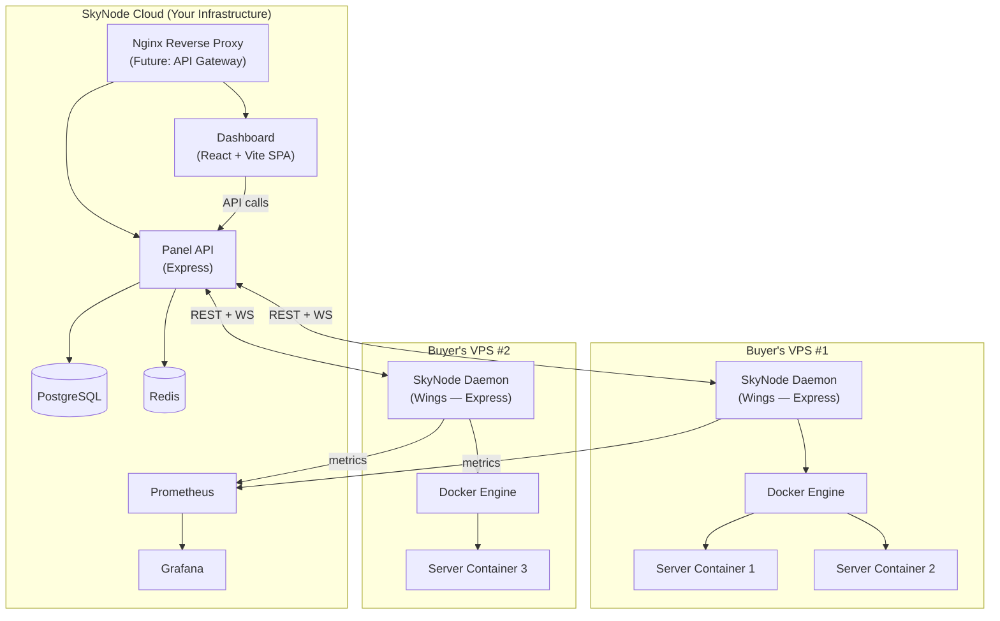
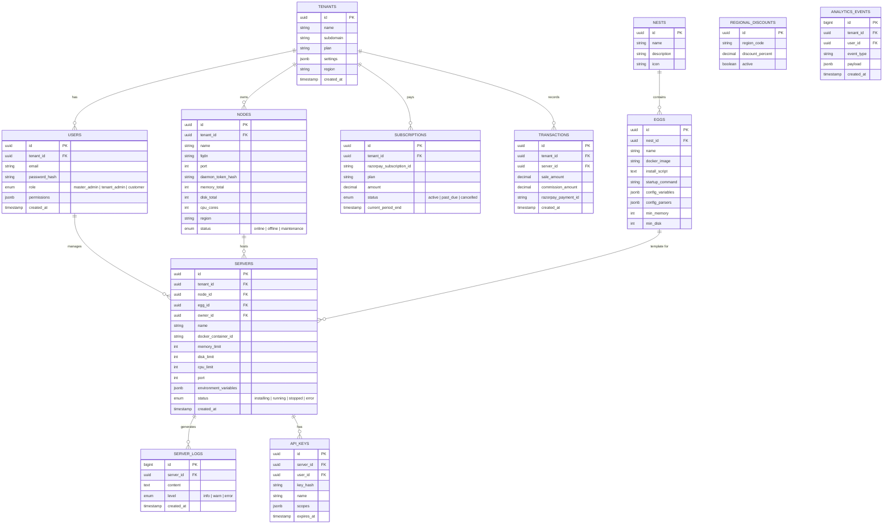
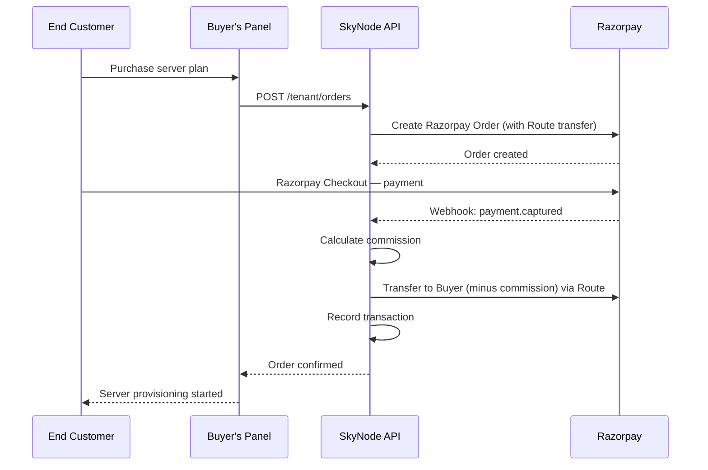

# SkyNode — Implementation Plan

## 1. Project Overview

SkyNode is a **multi-tenant SaaS platform** that enables VPS owners ("Buyers") to launch their own game-server, Discord-bot, or application-hosting businesses. SkyNode deploys, manages, monitors, and scales the Buyer's VPS fleet via a lightweight daemon. End-customers purchase servers through the Buyer's white-labeled storefront.

**Revenue model:** Subscription fee + max(10 % of every server sale, $5).

### Role Hierarchy

| Role | Scope | Capabilities |
|---|---|---|
| **Master Admin** (you) | Global | Full platform control, analytics, billing, tenant management |
| **Buyer (Tenant Admin)** | Their tenant | Manage VPS nodes, create plans, view customers, see statistics |
| **End Customer** | Their servers | Manage own servers, generate scoped API keys, view logs |

---

## 2. Recommended Tech Stack

> [!IMPORTANT]
> The coding environment is **JavaScript / TypeScript** as per your constraint. Every choice below stays within that ecosystem while optimising for scalability, minimal dependency count, and **future service extraction**.

### 2.1 Core Runtime & Framework

| Layer | Choice | Rationale |
|---|---|---|
| **Runtime** | Node.js 22 LTS | Latest LTS, native fetch, `AsyncLocalStorage` for tenant context |
| **API Framework** | **Express 5** | Largest ecosystem, simplest mental model; Express Routers are **portable** — each module can be extracted into its own Express server behind a Gateway with zero rewrite |
| **Language** | TypeScript 5.5 | Type safety across the entire monorepo |

> **Why Express over Fastify?** Fastify's plugin system creates tight coupling — extracting a Fastify plugin into a standalone service requires rewriting registration, decorators, and hooks. Express Routers are self-contained: copy the router, wrap it in `express().listen()`, and it's a microservice. This aligns with the Gateway-based scaling strategy.

> **Why not NestJS?** NestJS adds heavy abstraction layers (decorators, DI container, modules) that increase the package footprint. Express + its middleware ecosystem provides the same modularity with fewer packages.

### 2.2 Database

| Purpose | Choice | Rationale |
|---|---|---|
| **Primary DB** | **PostgreSQL 16** | Row-Level Security for tenant isolation, JSONB for flexible egg configs, excellent scaling |
| **Cache / Pub-Sub** | **Redis 7** | Session store, real-time event bus (WebSocket fan-out across instances), rate limiting |
| **ORM / Query Builder** | **Drizzle ORM** | Lightweight, TypeScript-native, generates raw SQL — minimal overhead vs Prisma |

**Multi-tenancy model:** Shared database, shared schema with a `tenant_id` column + PostgreSQL Row-Level Security (RLS) policies. This is the most cost-effective approach and simplifies operations while still enforcing hard tenant boundaries at the DB level.

### 2.3 Real-Time & Communication

| Purpose | Choice |
|---|---|
| **WebSockets** | `ws` library (standalone) — console streaming, live stats. Attached to the HTTP server, not coupled to the framework. |
| **Structured Logging** | **Winston** — JSON logs, tenant-tagged, multiple transports |

### 2.4 Auth & Security

| Purpose | Choice |
|---|---|
| **Authentication** | JWT (access + refresh tokens), **`jsonwebtoken`** |
| **Password hashing** | **argon2** (via `argon2` npm) |
| **RBAC** | Custom role + permission middleware (3 roles, scoped permissions) |
| **Rate limiting** | **`express-rate-limit`** backed by Redis via `rate-limit-redis` |
| **Validation** | **Zod** — TypeScript-native schema validation, framework-agnostic |
| **Security headers** | **Helmet** — essential HTTP security headers |

### 2.5 Containerisation & Daemon

| Purpose | Choice |
|---|---|
| **Container engine** | Docker (on buyer's VPS) |
| **Daemon** | **SkyNode Wings** — a lightweight Node.js process (Express) that runs on each VPS, communicates with the Panel via REST + WebSocket |
| **SFTP** | Built-in SFTP server inside the daemon (via `ssh2` npm) |

### 2.6 Frontend (Dashboard)

| Purpose | Choice |
|---|---|
| **UI Library** | **React 19** |
| **Build Tool** | **Vite 6** — lightning-fast HMR, native ESM, minimal config |
| **Routing** | **React Router v7** — nested layouts, route guards, lazy loading |
| **Styling** | Vanilla CSS with CSS custom properties (design tokens) |
| **State** | React Context + SWR for data fetching |
| **Charts** | **Chart.js** (lightweight) |

> **Why React + Vite over Next.js?** SkyNode's dashboard is a pure SPA — all data comes from the Express API. There's no SEO requirement, no need for SSR. Next.js adds SSR/ISR complexity, tightly couples frontend to a Node.js server, and bloats the deployment. Vite gives sub-100ms HMR, a clean SPA build, and full decoupling from the backend.

### 2.7 Payments

| Purpose | Choice |
|---|---|
| **Payment gateway** | **Razorpay** — subscriptions for Buyers, one-time / recurring for end-customers |
| **Commission tracking** | Internal ledger table; Razorpay Route for split payments |

### 2.8 DevOps / Infra

| Purpose | Choice |
|---|---|
| **Monorepo** | npm workspaces (zero extra tooling) |
| **Containerisation** | Docker Compose (dev), Docker + reverse proxy (prod) |
| **CI/CD** | GitHub Actions |
| **Monitoring** | Prometheus + Grafana (self-hosted) |
| **API Gateway** | Nginx (Phase 1–2), Express Gateway or Kong (Phase 3+) |

### Dependency Summary (~22 core packages)

```
express, jsonwebtoken, ws, express-rate-limit, cors, cookie-parser, helmet, zod
drizzle-orm, drizzle-kit, postgres (pg driver)
argon2, razorpay, winston, ssh2, dockerode
react, react-dom, vite, react-router-dom, swr, chart.js
```

---

## 3. System Architecture



### Key Architectural Decisions

1. **Gateway-Ready Monorepo:** Every feature module is an Express Router. Today they mount on one Express app. In Phase 3, any router can be extracted into its own `express().listen()` behind a Gateway. **Zero business logic rewrite.**
2. **Panel ↔ Daemon Protocol:** REST for commands (start/stop/install), WebSocket for real-time (console, stats).
3. **Daemon Auth:** Each daemon gets a unique API token (stored encrypted in DB). TLS mutual authentication optional.
4. **Horizontal Scaling:** Panel is stateless (sessions in Redis). Multiple Panel instances behind a load balancer.
5. **Tenant Isolation:** Every DB query is scoped to `tenant_id` via Drizzle middleware + PostgreSQL RLS.

---

## 4. Database Schema (Key Tables)



---

## 5. API Catalog

### 5.1 Authentication APIs

| Method | Endpoint | Description | Access |
|---|---|---|---|
| POST | `/api/auth/register` | Register new buyer/customer | Public |
| POST | `/api/auth/login` | Login, returns JWT pair | Public |
| POST | `/api/auth/refresh` | Refresh access token | Authenticated |
| POST | `/api/auth/logout` | Invalidate refresh token | Authenticated |
| GET | `/api/auth/me` | Get current user profile | Authenticated |

### 5.2 Master Admin APIs

| Method | Endpoint | Description |
|---|---|---|
| GET | `/api/admin/tenants` | List all tenants |
| POST | `/api/admin/tenants` | Create tenant |
| PATCH | `/api/admin/tenants/:id` | Update tenant (suspend, change plan) |
| DELETE | `/api/admin/tenants/:id` | Delete tenant |
| GET | `/api/admin/analytics` | Platform-wide analytics |
| GET | `/api/admin/revenue` | Revenue & commission dashboard |
| GET/POST/PATCH/DELETE | `/api/admin/nests` | CRUD nests |
| GET/POST/PATCH/DELETE | `/api/admin/eggs` | CRUD eggs |
| GET/POST | `/api/admin/regional-discounts` | Manage regional pricing |
| GET | `/api/admin/subscriptions` | View all subscriptions |

### 5.3 Tenant (Buyer) APIs

| Method | Endpoint | Description |
|---|---|---|
| GET | `/api/tenant/dashboard` | Tenant overview stats |
| GET/POST/PATCH/DELETE | `/api/tenant/nodes` | CRUD their VPS nodes |
| POST | `/api/tenant/nodes/:id/verify` | Test daemon connectivity |
| GET | `/api/tenant/nodes/:id/stats` | Live node resource stats |
| GET/POST/PATCH/DELETE | `/api/tenant/servers` | CRUD servers for their customers |
| POST | `/api/tenant/servers/:id/power` | Start / stop / restart / kill |
| GET | `/api/tenant/servers/:id/console` | WebSocket console stream |
| GET | `/api/tenant/customers` | List their end-customers |
| POST | `/api/tenant/customers` | Create end-customer account |
| GET | `/api/tenant/billing` | Billing & commission summary |
| GET | `/api/tenant/plans` | Manage hosting plans they offer |
| POST | `/api/tenant/plans` | Create a hosting plan |

### 5.4 Customer APIs

| Method | Endpoint | Description |
|---|---|---|
| GET | `/api/customer/servers` | List own servers |
| GET | `/api/customer/servers/:id` | Server details |
| POST | `/api/customer/servers/:id/power` | Power actions |
| GET | `/api/customer/servers/:id/console` | WebSocket console |
| GET | `/api/customer/servers/:id/files` | File manager (SFTP proxy) |
| POST/DELETE | `/api/customer/servers/:id/files` | Upload / delete files |
| GET | `/api/customer/servers/:id/logs` | Server logs |
| GET/POST/DELETE | `/api/customer/api-keys` | Manage API keys (scoped to their server) |

### 5.5 Daemon (Wings) Internal APIs

| Method | Endpoint | Description |
|---|---|---|
| POST | `/daemon/handshake` | Register daemon with panel |
| POST | `/daemon/heartbeat` | Periodic health + stats report |
| POST | `/daemon/servers/:id/install` | Install a server from egg |
| POST | `/daemon/servers/:id/power` | Execute power action |
| GET | `/daemon/servers/:id/logs` | Fetch recent logs |
| WS | `/daemon/ws` | Bidirectional real-time channel |

---

## 6. Pages & UI Layout

Below is every page you need to design. You mentioned using Google Stitch for UI → Figma export, so this serves as your complete page map.

### 6.1 Public / Marketing

| # | Page | Route | Key Components |
|---|---|---|---|
| 1 | Landing Page | `/` | Hero, features, pricing tiers, testimonials, CTA |
| 2 | Pricing | `/pricing` | Plan comparison table, regional discount badge |
| 3 | Login | `/login` | Email/password form, "Forgot password" link |
| 4 | Register | `/register` | Multi-step: account info → plan selection → payment |
| 5 | Forgot Password | `/forgot-password` | Email input form |

### 6.2 Master Admin Dashboard

| # | Page | Route |
|---|---|---|
| 6 | Admin Overview | `/admin` |
| 7 | Tenant Management | `/admin/tenants` |
| 8 | Tenant Detail | `/admin/tenants/:id` |
| 9 | Nest Management | `/admin/nests` |
| 10 | Egg Editor | `/admin/nests/:nestId/eggs/:eggId` |
| 11 | Revenue & Commissions | `/admin/revenue` |
| 12 | Regional Discounts | `/admin/discounts` |
| 13 | Platform Analytics | `/admin/analytics` |
| 14 | Subscription Management | `/admin/subscriptions` |
| 15 | System Settings | `/admin/settings` |

### 6.3 Buyer (Tenant) Dashboard

| # | Page | Route |
|---|---|---|
| 16 | Tenant Overview | `/dashboard` |
| 17 | Node Management | `/dashboard/nodes` |
| 18 | Node Detail + Stats | `/dashboard/nodes/:id` |
| 19 | Server List | `/dashboard/servers` |
| 20 | Server Detail | `/dashboard/servers/:id` |
| 21 | Server Console | `/dashboard/servers/:id/console` |
| 22 | Server Files | `/dashboard/servers/:id/files` |
| 23 | Create Server | `/dashboard/servers/create` |
| 24 | Customer Management | `/dashboard/customers` |
| 25 | Hosting Plans | `/dashboard/plans` |
| 26 | Billing & Invoices | `/dashboard/billing` |
| 27 | Tenant Settings | `/dashboard/settings` |

### 6.4 End Customer Panel

| # | Page | Route |
|---|---|---|
| 28 | My Servers | `/panel` |
| 29 | Server Detail | `/panel/servers/:id` |
| 30 | Server Console | `/panel/servers/:id/console` |
| 31 | Server Files | `/panel/servers/:id/files` |
| 32 | Server Logs | `/panel/servers/:id/logs` |
| 33 | API Keys | `/panel/api-keys` |
| 34 | Account Settings | `/panel/settings` |

**Total: 34 pages**

---

## 7. Nest & Egg System

Modeled after Pterodactyl but stored as JSON in PostgreSQL for flexibility.

### Egg JSON Schema

```jsonc
{
  "name": "Paper Minecraft",
  "nest": "Minecraft",
  "docker_image": "ghcr.io/skynode/yolks:java_21",
  "startup_command": "java -Xms128M -Xmx{{SERVER_MEMORY}}M -jar server.jar",
  "install_script": "#!/bin/bash\ncurl -o server.jar https://api.papermc.io/v2/...",
  "variables": [
    {
      "name": "SERVER_VERSION",
      "description": "Minecraft server version",
      "default": "1.21.4",
      "rules": "required|string",
      "user_editable": true
    },
    {
      "name": "SERVER_MEMORY",
      "description": "Memory allocation in MB",
      "default": "1024",
      "rules": "required|integer|min:512",
      "user_editable": false
    }
  ],
  "config_parsers": {
    "server.properties": {
      "parser": "properties",
      "find": {
        "server-port": "{{server.port}}",
        "max-players": "{{config.max_players}}"
      }
    }
  },
  "min_memory": 512,
  "min_disk": 2048
}
```

### Supported Games/Applications (Initial Set — matching Pterodactyl)

| Nest | Eggs |
|---|---|
| **Minecraft** | Vanilla, Paper, Forge, Fabric, Spigot, BungeeCord, Velocity |
| **Source Engine** | CS2, Garry's Mod, TF2 |
| **Rust** | Rust Dedicated Server |
| **Voice** | TeamSpeak 3, Mumble |
| **Discord Bots** | Node.js Bot, Python Bot, Java Bot |
| **Generic** | Node.js App, Python App, Java App, Custom Docker |

---

## 8. Commission & Billing Logic

```
For each end-customer server sale:
  commission = max(sale_amount * 0.10, 5.00)
  
  if regional_discount applies:
    sale_amount = sale_amount * (1 - discount_percent)
    commission = max(sale_amount * 0.10, 5.00)  // calculated on discounted price
```

### Razorpay Integration Flow



---

## 9. Data Collection & AI Readiness

Per constraint #10, we need to gather data for future AI models.

### Analytics Events Table

We capture structured events in `analytics_events`:

| Event Type | Payload Example |
|---|---|
| `server.created` | `{ egg_id, memory, region }` |
| `server.crashed` | `{ error_code, uptime_seconds }` |
| `node.resource_peak` | `{ cpu_percent, memory_percent }` |
| `customer.churn` | `{ tenure_days, servers_count }` |
| `sale.completed` | `{ amount, plan, region }` |

This data can later feed:
- **Predictive scaling** — forecast node resource needs
- **Churn prediction** — identify at-risk customers
- **Pricing optimization** — optimal plan pricing by region

---

## 10. Logging System

Per constraint #11, comprehensive logging for every hosted service.

### Log Architecture

```
Server Container → stdout/stderr
       ↓
  Daemon captures via Docker log driver
       ↓
  Streams to Panel via WebSocket
       ↓
  Panel persists to server_logs table (PostgreSQL)
       ↓
  Queryable via API with filters (level, time range, search)
```

- **Retention:** Configurable per tenant (default 7 days, premium 30 days)
- **Real-time:** Console WebSocket streams live logs to the dashboard
- **Structured:** All logs tagged with `server_id`, `level`, `timestamp`

---

## 11. Monorepo Structure (Gateway-Ready)

```
skynode/
├── packages/
│   ├── panel-api/           # Express API server
│   │   ├── src/
│   │   │   ├── middleware/  # Express middleware (auth, tenant-context, etc.)
│   │   │   ├── modules/    # Feature modules — each is an Express Router
│   │   │   │   ├── auth/        # ⚡ Extractable
│   │   │   │   ├── tenants/     # ⚡ Extractable
│   │   │   │   ├── nodes/       # ⚡ Extractable
│   │   │   │   ├── servers/     # ⚡ Extractable
│   │   │   │   ├── eggs/        # ⚡ Extractable
│   │   │   │   ├── billing/     # ⚡ Extractable (Phase 3 candidate)
│   │   │   │   └── analytics/   # ⚡ Extractable (Phase 3 candidate)
│   │   │   ├── ws/          # WebSocket server (standalone ws library)
│   │   │   ├── db/          # Drizzle schema, migrations
│   │   │   └── index.ts     # Entry point
│   │   └── package.json
│   │
│   ├── dashboard/           # React + Vite SPA
│   │   ├── src/
│   │   │   ├── pages/       # Route page components
│   │   │   │   ├── public/  # Landing, login, register
│   │   │   │   ├── admin/   # Master admin pages
│   │   │   │   ├── dashboard/ # Buyer pages
│   │   │   │   └── panel/   # Customer pages
│   │   │   ├── components/
│   │   │   ├── router.tsx   # React Router config
│   │   │   └── main.tsx     # Entry point
│   │   ├── index.html       # Vite entry HTML
│   │   └── package.json
│   │
│   ├── daemon/              # SkyNode Wings (runs on buyer VPS)
│   │   ├── src/
│   │   │   ├── docker/      # Docker management (via dockerode)
│   │   │   ├── sftp/        # Built-in SFTP server
│   │   │   ├── metrics/     # Prometheus metrics exporter
│   │   │   └── index.ts
│   │   └── package.json
│   │
│   └── shared/              # Shared types, constants, utils
│       ├── src/
│       │   ├── types/
│       │   ├── constants/
│       │   └── utils/
│       └── package.json
│
├── docker-compose.yml       # Dev environment (Postgres, Redis, Grafana)
├── package.json             # Root workspace config
├── tsconfig.base.json
└── README.md
```

### Service Extraction Pattern (Phase 3+)

```
# To extract billing into its own service:
1. Copy packages/panel-api/src/modules/billing/ → packages/billing-service/src/
2. Create packages/billing-service/src/index.ts:
     const app = express()
     app.use('/api/v1/billing', billingRouter)
     app.listen(4001)
3. Update Gateway config to route /api/v1/billing/* → billing-service:4001
4. Done. Zero business logic changes.
```

---

## 12. Phased Rollout Plan

### Phase 1 — Foundation (Weeks 1–3)
- [ ] Monorepo setup (npm workspaces, TypeScript, ESLint, Prettier)
- [ ] PostgreSQL schema + Drizzle migrations
- [ ] Auth system (register, login, JWT, RBAC)
- [ ] Master Admin: Tenant CRUD
- [ ] Master Admin: Nest & Egg CRUD
- [ ] Basic React + Vite dashboard shell with auth

### Phase 2 — Node & Daemon (Weeks 4–6)
- [ ] Daemon scaffold (Express process on VPS)
- [ ] Daemon ↔ Panel handshake & heartbeat
- [ ] Docker container lifecycle (create, start, stop, kill)
- [ ] Node management APIs + UI
- [ ] Server creation from egg template
- [ ] Console WebSocket streaming (via ws library)

### Phase 3 — Server Management (Weeks 7–9)
- [ ] Full server CRUD (Buyer + Customer views)
- [ ] File manager (SFTP proxy)
- [ ] Log system (capture, persist, query, stream)
- [ ] Server environment variable management
- [ ] Scoped API key generation for customers

### Phase 4 — Billing & Commerce (Weeks 10–11)
- [ ] Razorpay integration (subscriptions for Buyers)
- [ ] Razorpay Route (split payments for end-customer sales)
- [ ] Commission calculation engine
- [ ] Regional discount system
- [ ] Billing dashboard UI

### Phase 5 — Monitoring & Analytics (Weeks 12–13)
- [ ] Prometheus metrics exporter in daemon
- [ ] Grafana dashboards
- [ ] Analytics event collection
- [ ] Master Admin analytics dashboard
- [ ] Tenant statistics dashboard

### Phase 6 — Polish & Launch (Weeks 14–16)
- [ ] Landing page + marketing site
- [ ] End-to-end testing
- [ ] Security audit (RLS verification, API pen testing)
- [ ] Documentation (API docs, daemon setup guide, gateway extraction guide)
- [ ] Production deployment (Docker, CI/CD)

---

## Resolved Decisions

| # | Question | Decision |
|---|---|---|
| 1 | **Tenancy model** | Subdomain (`slug.skynode.com`) + **custom domain** support. Buyer can link their own domain (e.g., `indiasells.com`). Requires wildcard DNS + Let's Encrypt + Nginx reverse proxy with dynamic SSL. |
| 2 | **Databases** | **Managed services** — Neon (PostgreSQL) + Upstash (Redis). Zero DB ops overhead. |
| 3 | **White-labeling** | Full: company name, icon, logo, support email, primary/secondary colors, custom CSS, game selection (enable/disable eggs), custom game logos. **Backup storage is buyer-provided** (S3/R2/Backblaze). |
| 4 | **Hosting** | ZAP-Hosting VPS. Docker Compose for deployment. Nginx as reverse proxy. |
| 5 | **Email** | **Resend** (free tier: 3,000 emails/month, 100/day). Upgrade when revenue allows. |
| 6 | **Framework** | **Express 5** over Fastify. Express Routers are portable → Gateway-ready microservice extraction without rewriting business logic. |
| 7 | **Gateway strategy** | Nginx (Phase 1–2). When services are extracted (Phase 3+), Nginx route configs or Express Gateway handle routing. |

---

## Detailed Reference Documents

- **All API Routes (132 endpoints):** See [api_routes.md](api_routes.md)
- **Full Database Schema (17 tables):** See [database_schema.md](database_schema.md)

---

## Verification Plan

### Automated Tests
- Unit tests for commission calculation, RLS tenant isolation, egg validation
- Integration tests for auth flow, server lifecycle, daemon handshake
- `npm test` via Jest across all workspace packages

### Manual Verification
- End-to-end flow: Register buyer → add node → create server → customer purchases → console access
- Razorpay test mode for billing flows
- Load testing daemon with multiple concurrent containers
- Security: verify RLS prevents cross-tenant data access
