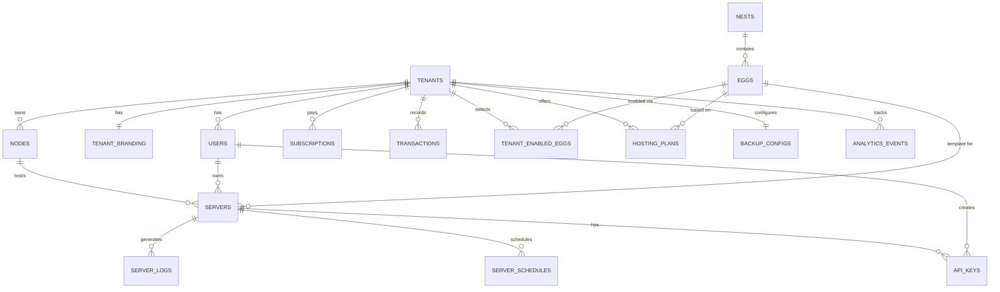

# SkyNode — Database Schema

## Overview

- **17 tables** across 6 domains
- **PostgreSQL 16** with Row-Level Security (RLS)
- **Tenant isolation** via `tenant_id` column + RLS policies
- **UUIDs** for all primary keys

---

## Entity Relationship Diagram



---

## Tables

### 1. `tenants`

The Buyers — companies/individuals who purchase a SkyNode subscription.

```sql
CREATE TABLE tenants (
    id              UUID PRIMARY KEY DEFAULT gen_random_uuid(),
    name            VARCHAR(255) NOT NULL,
    slug            VARCHAR(100) NOT NULL UNIQUE,       -- used for subdomain: slug.skynode.com
    custom_domain   VARCHAR(255) UNIQUE,                -- e.g. indiasells.com
    domain_verified BOOLEAN DEFAULT FALSE,
    owner_email     VARCHAR(255) NOT NULL,
    plan            VARCHAR(50) NOT NULL DEFAULT 'starter', -- starter | pro | enterprise
    status          VARCHAR(20) NOT NULL DEFAULT 'active',  -- active | suspended | cancelled
    region          VARCHAR(10),                         -- ISO country code for regional discount
    settings        JSONB DEFAULT '{}',
    created_at      TIMESTAMPTZ NOT NULL DEFAULT NOW(),
    updated_at      TIMESTAMPTZ NOT NULL DEFAULT NOW()
);

CREATE INDEX idx_tenants_slug ON tenants(slug);
CREATE INDEX idx_tenants_custom_domain ON tenants(custom_domain);
CREATE INDEX idx_tenants_status ON tenants(status);
```

---

### 2. `tenant_branding`

White-label customization for each tenant.

```sql
CREATE TABLE tenant_branding (
    id              UUID PRIMARY KEY DEFAULT gen_random_uuid(),
    tenant_id       UUID NOT NULL UNIQUE REFERENCES tenants(id) ON DELETE CASCADE,
    company_name    VARCHAR(255),           -- display name (can differ from tenant.name)
    logo_url        VARCHAR(500),
    icon_url        VARCHAR(500),
    primary_color   VARCHAR(7) DEFAULT '#6366f1',  -- hex color
    secondary_color VARCHAR(7) DEFAULT '#8b5cf6',
    support_email   VARCHAR(255),
    custom_css      TEXT,                   -- optional custom stylesheet
    created_at      TIMESTAMPTZ NOT NULL DEFAULT NOW(),
    updated_at      TIMESTAMPTZ NOT NULL DEFAULT NOW()
);
```

---

### 3. `users`

All users across all roles.

```sql
CREATE TABLE users (
    id              UUID PRIMARY KEY DEFAULT gen_random_uuid(),
    tenant_id       UUID REFERENCES tenants(id) ON DELETE CASCADE,  -- NULL for master_admin
    email           VARCHAR(255) NOT NULL,
    password_hash   VARCHAR(255) NOT NULL,
    name            VARCHAR(255) NOT NULL,
    role            VARCHAR(20) NOT NULL,   -- master_admin | tenant_admin | customer
    status          VARCHAR(20) NOT NULL DEFAULT 'active',  -- active | suspended | banned
    email_verified  BOOLEAN DEFAULT FALSE,
    last_login_at   TIMESTAMPTZ,
    created_at      TIMESTAMPTZ NOT NULL DEFAULT NOW(),
    updated_at      TIMESTAMPTZ NOT NULL DEFAULT NOW(),
    
    UNIQUE(email, tenant_id)
);

CREATE INDEX idx_users_tenant ON users(tenant_id);
CREATE INDEX idx_users_email ON users(email);
CREATE INDEX idx_users_role ON users(role);

-- RLS Policy
ALTER TABLE users ENABLE ROW LEVEL SECURITY;
CREATE POLICY tenant_isolation_users ON users
    USING (tenant_id = current_setting('app.current_tenant_id')::UUID 
           OR current_setting('app.current_role') = 'master_admin');
```

---

### 4. `nodes`

VPS machines registered by tenants, running the SkyNode daemon.

```sql
CREATE TABLE nodes (
    id                  UUID PRIMARY KEY DEFAULT gen_random_uuid(),
    tenant_id           UUID NOT NULL REFERENCES tenants(id) ON DELETE CASCADE,
    name                VARCHAR(255) NOT NULL,
    fqdn                VARCHAR(255) NOT NULL,          -- hostname or IP
    daemon_port         INT NOT NULL DEFAULT 8443,
    daemon_token_hash   VARCHAR(255) NOT NULL,          -- hashed auth token
    memory_total_mb     INT NOT NULL,
    disk_total_mb       INT NOT NULL,
    cpu_cores           INT NOT NULL,
    memory_used_mb      INT DEFAULT 0,
    disk_used_mb        INT DEFAULT 0,
    region              VARCHAR(100),
    status              VARCHAR(20) NOT NULL DEFAULT 'offline', -- online | offline | maintenance
    last_heartbeat_at   TIMESTAMPTZ,
    created_at          TIMESTAMPTZ NOT NULL DEFAULT NOW(),
    updated_at          TIMESTAMPTZ NOT NULL DEFAULT NOW()
);

CREATE INDEX idx_nodes_tenant ON nodes(tenant_id);
CREATE INDEX idx_nodes_status ON nodes(status);

ALTER TABLE nodes ENABLE ROW LEVEL SECURITY;
CREATE POLICY tenant_isolation_nodes ON nodes
    USING (tenant_id = current_setting('app.current_tenant_id')::UUID
           OR current_setting('app.current_role') = 'master_admin');
```

---

### 5. `nests`

Categories for grouping eggs (e.g., "Minecraft", "Voice Servers").

```sql
CREATE TABLE nests (
    id              UUID PRIMARY KEY DEFAULT gen_random_uuid(),
    name            VARCHAR(255) NOT NULL UNIQUE,
    description     TEXT,
    icon            VARCHAR(500),           -- icon URL or emoji
    sort_order      INT DEFAULT 0,
    created_at      TIMESTAMPTZ NOT NULL DEFAULT NOW(),
    updated_at      TIMESTAMPTZ NOT NULL DEFAULT NOW()
);
```

---

### 6. `eggs`

Server templates — Docker image, install script, startup command, variables.

```sql
CREATE TABLE eggs (
    id                  UUID PRIMARY KEY DEFAULT gen_random_uuid(),
    nest_id             UUID NOT NULL REFERENCES nests(id) ON DELETE CASCADE,
    name                VARCHAR(255) NOT NULL,
    description         TEXT,
    docker_image        VARCHAR(500) NOT NULL,
    startup_command     TEXT NOT NULL,
    install_script      TEXT NOT NULL,           -- bash script run on install
    config_variables    JSONB DEFAULT '[]',      -- user-configurable variables
    config_parsers      JSONB DEFAULT '{}',      -- auto-modify config files
    min_memory_mb       INT DEFAULT 512,
    min_disk_mb         INT DEFAULT 1024,
    default_port        INT DEFAULT 25565,
    logo_url            VARCHAR(500),
    sort_order          INT DEFAULT 0,
    created_at          TIMESTAMPTZ NOT NULL DEFAULT NOW(),
    updated_at          TIMESTAMPTZ NOT NULL DEFAULT NOW()
);

CREATE INDEX idx_eggs_nest ON eggs(nest_id);
```

**`config_variables` JSONB structure:**
```json
[
  {
    "name": "SERVER_VERSION",
    "description": "Game server version",
    "default": "1.21.4",
    "rules": "required|string",
    "user_editable": true
  }
]
```

**`config_parsers` JSONB structure:**
```json
{
  "server.properties": {
    "parser": "properties",
    "find": {
      "server-port": "{{server.port}}",
      "max-players": "{{config.max_players}}"
    }
  }
}
```

---

### 7. `tenant_enabled_eggs`

Which eggs a tenant has chosen to offer to their customers.

```sql
CREATE TABLE tenant_enabled_eggs (
    id          UUID PRIMARY KEY DEFAULT gen_random_uuid(),
    tenant_id   UUID NOT NULL REFERENCES tenants(id) ON DELETE CASCADE,
    egg_id      UUID NOT NULL REFERENCES eggs(id) ON DELETE CASCADE,
    custom_logo VARCHAR(500),               -- tenant can override game logo
    created_at  TIMESTAMPTZ NOT NULL DEFAULT NOW(),
    
    UNIQUE(tenant_id, egg_id)
);

CREATE INDEX idx_tenant_eggs_tenant ON tenant_enabled_eggs(tenant_id);
```

---

### 8. `hosting_plans`

Plans that tenants sell to their end customers.

```sql
CREATE TABLE hosting_plans (
    id              UUID PRIMARY KEY DEFAULT gen_random_uuid(),
    tenant_id       UUID NOT NULL REFERENCES tenants(id) ON DELETE CASCADE,
    egg_id          UUID NOT NULL REFERENCES eggs(id),
    name            VARCHAR(255) NOT NULL,
    description     TEXT,
    memory_mb       INT NOT NULL,
    disk_mb         INT NOT NULL,
    cpu_percent     INT NOT NULL DEFAULT 100,   -- percentage of one core
    price_monthly   DECIMAL(10,2) NOT NULL,
    price_quarterly DECIMAL(10,2),
    price_yearly    DECIMAL(10,2),
    is_active       BOOLEAN DEFAULT TRUE,
    sort_order      INT DEFAULT 0,
    created_at      TIMESTAMPTZ NOT NULL DEFAULT NOW(),
    updated_at      TIMESTAMPTZ NOT NULL DEFAULT NOW()
);

CREATE INDEX idx_plans_tenant ON hosting_plans(tenant_id);
```

---

### 9. `servers`

Individual server instances running in Docker containers.

```sql
CREATE TABLE servers (
    id                      UUID PRIMARY KEY DEFAULT gen_random_uuid(),
    tenant_id               UUID NOT NULL REFERENCES tenants(id) ON DELETE CASCADE,
    node_id                 UUID NOT NULL REFERENCES nodes(id),
    egg_id                  UUID NOT NULL REFERENCES eggs(id),
    owner_id                UUID NOT NULL REFERENCES users(id),
    hosting_plan_id         UUID REFERENCES hosting_plans(id),
    name                    VARCHAR(255) NOT NULL,
    docker_container_id     VARCHAR(100),
    memory_limit_mb         INT NOT NULL,
    disk_limit_mb           INT NOT NULL,
    cpu_limit_percent       INT NOT NULL DEFAULT 100,
    port                    INT NOT NULL,
    additional_ports        JSONB DEFAULT '[]',
    environment_variables   JSONB DEFAULT '{}',
    status                  VARCHAR(20) NOT NULL DEFAULT 'installing',
                            -- installing | running | stopped | error | suspended
    suspended_reason        TEXT,
    installed_at            TIMESTAMPTZ,
    created_at              TIMESTAMPTZ NOT NULL DEFAULT NOW(),
    updated_at              TIMESTAMPTZ NOT NULL DEFAULT NOW()
);

CREATE INDEX idx_servers_tenant ON servers(tenant_id);
CREATE INDEX idx_servers_node ON servers(node_id);
CREATE INDEX idx_servers_owner ON servers(owner_id);
CREATE INDEX idx_servers_status ON servers(status);

ALTER TABLE servers ENABLE ROW LEVEL SECURITY;
CREATE POLICY tenant_isolation_servers ON servers
    USING (tenant_id = current_setting('app.current_tenant_id')::UUID
           OR current_setting('app.current_role') = 'master_admin');
```

---

### 10. `server_schedules`

Cron-based scheduled tasks for servers.

```sql
CREATE TABLE server_schedules (
    id          UUID PRIMARY KEY DEFAULT gen_random_uuid(),
    server_id   UUID NOT NULL REFERENCES servers(id) ON DELETE CASCADE,
    name        VARCHAR(255) NOT NULL,
    cron_expr   VARCHAR(100) NOT NULL,      -- e.g. "0 */6 * * *"
    action      VARCHAR(50) NOT NULL,       -- power_restart | power_stop | command | backup
    payload     JSONB DEFAULT '{}',         -- e.g. { "command": "say Server restarting!" }
    is_active   BOOLEAN DEFAULT TRUE,
    last_run_at TIMESTAMPTZ,
    next_run_at TIMESTAMPTZ,
    created_at  TIMESTAMPTZ NOT NULL DEFAULT NOW()
);

CREATE INDEX idx_schedules_server ON server_schedules(server_id);
CREATE INDEX idx_schedules_next_run ON server_schedules(next_run_at);
```

---

### 11. `server_logs`

Log entries captured from server containers.

```sql
CREATE TABLE server_logs (
    id          BIGINT GENERATED ALWAYS AS IDENTITY PRIMARY KEY,
    server_id   UUID NOT NULL REFERENCES servers(id) ON DELETE CASCADE,
    content     TEXT NOT NULL,
    level       VARCHAR(10) DEFAULT 'info',     -- info | warn | error
    source      VARCHAR(20) DEFAULT 'stdout',   -- stdout | stderr | system
    created_at  TIMESTAMPTZ NOT NULL DEFAULT NOW()
);

CREATE INDEX idx_logs_server_time ON server_logs(server_id, created_at DESC);
CREATE INDEX idx_logs_level ON server_logs(level);

-- Partition by month for performance (optional, recommended for scale)
-- CREATE TABLE server_logs (...) PARTITION BY RANGE (created_at);
```

---

### 12. `api_keys`

Scoped API keys for end customers (e.g., for Tabex integration).

```sql
CREATE TABLE api_keys (
    id          UUID PRIMARY KEY DEFAULT gen_random_uuid(),
    user_id     UUID NOT NULL REFERENCES users(id) ON DELETE CASCADE,
    server_id   UUID NOT NULL REFERENCES servers(id) ON DELETE CASCADE,
    name        VARCHAR(255) NOT NULL,
    key_hash    VARCHAR(255) NOT NULL,          -- hashed key (shown once on creation)
    key_prefix  VARCHAR(10) NOT NULL,           -- first 8 chars for identification
    scopes      JSONB NOT NULL DEFAULT '["power", "console", "files"]',
    last_used_at TIMESTAMPTZ,
    expires_at  TIMESTAMPTZ,
    created_at  TIMESTAMPTZ NOT NULL DEFAULT NOW()
);

CREATE INDEX idx_api_keys_user ON api_keys(user_id);
CREATE INDEX idx_api_keys_server ON api_keys(server_id);
CREATE INDEX idx_api_keys_prefix ON api_keys(key_prefix);
```

---

### 13. `subscriptions`

Buyer subscriptions to SkyNode.

```sql
CREATE TABLE subscriptions (
    id                      UUID PRIMARY KEY DEFAULT gen_random_uuid(),
    tenant_id               UUID NOT NULL UNIQUE REFERENCES tenants(id) ON DELETE CASCADE,
    razorpay_subscription_id VARCHAR(255) UNIQUE,
    razorpay_customer_id    VARCHAR(255),
    plan                    VARCHAR(50) NOT NULL,           -- starter | pro | enterprise
    amount_monthly          DECIMAL(10,2) NOT NULL,
    currency                VARCHAR(3) DEFAULT 'USD',
    status                  VARCHAR(20) NOT NULL DEFAULT 'active',
                            -- active | past_due | cancelled | trialing
    trial_ends_at           TIMESTAMPTZ,
    current_period_start    TIMESTAMPTZ,
    current_period_end      TIMESTAMPTZ,
    cancelled_at            TIMESTAMPTZ,
    created_at              TIMESTAMPTZ NOT NULL DEFAULT NOW(),
    updated_at              TIMESTAMPTZ NOT NULL DEFAULT NOW()
);

CREATE INDEX idx_subscriptions_status ON subscriptions(status);
```

---

### 14. `transactions`

Records of every server sale and commission.

```sql
CREATE TABLE transactions (
    id                  UUID PRIMARY KEY DEFAULT gen_random_uuid(),
    tenant_id           UUID NOT NULL REFERENCES tenants(id),
    server_id           UUID REFERENCES servers(id),
    customer_id         UUID REFERENCES users(id),
    type                VARCHAR(30) NOT NULL,       -- server_purchase | subscription | refund
    sale_amount         DECIMAL(10,2) NOT NULL,
    discount_amount     DECIMAL(10,2) DEFAULT 0,
    commission_amount   DECIMAL(10,2) NOT NULL,     -- max(sale * 0.10, 5.00)
    net_to_tenant       DECIMAL(10,2) NOT NULL,     -- sale - commission
    currency            VARCHAR(3) DEFAULT 'USD',
    razorpay_payment_id VARCHAR(255),
    status              VARCHAR(20) DEFAULT 'completed', -- completed | refunded | pending
    created_at          TIMESTAMPTZ NOT NULL DEFAULT NOW()
);

CREATE INDEX idx_transactions_tenant ON transactions(tenant_id);
CREATE INDEX idx_transactions_date ON transactions(created_at);
CREATE INDEX idx_transactions_type ON transactions(type);
```

---

### 15. `regional_discounts`

Regional pricing discounts managed by Master Admin.

```sql
CREATE TABLE regional_discounts (
    id                  UUID PRIMARY KEY DEFAULT gen_random_uuid(),
    region_code         VARCHAR(10) NOT NULL UNIQUE,    -- ISO 3166-1 alpha-2 (e.g. IN, BR)
    region_name         VARCHAR(100) NOT NULL,
    discount_percent    DECIMAL(5,2) NOT NULL,          -- e.g. 30.00 = 30% off
    is_active           BOOLEAN DEFAULT TRUE,
    created_at          TIMESTAMPTZ NOT NULL DEFAULT NOW(),
    updated_at          TIMESTAMPTZ NOT NULL DEFAULT NOW()
);
```

---

### 16. `analytics_events`

Event data for future AI/ML models.

```sql
CREATE TABLE analytics_events (
    id          BIGINT GENERATED ALWAYS AS IDENTITY PRIMARY KEY,
    tenant_id   UUID REFERENCES tenants(id),
    user_id     UUID REFERENCES users(id),
    event_type  VARCHAR(100) NOT NULL,      -- server.created, server.crashed, sale.completed, etc.
    payload     JSONB NOT NULL DEFAULT '{}',
    ip_address  INET,
    user_agent  VARCHAR(500),
    created_at  TIMESTAMPTZ NOT NULL DEFAULT NOW()
);

CREATE INDEX idx_analytics_tenant ON analytics_events(tenant_id);
CREATE INDEX idx_analytics_type ON analytics_events(event_type);
CREATE INDEX idx_analytics_time ON analytics_events(created_at);
```

---

### 17. `backup_configs`

Tenant-provided backup storage credentials (they buy their own storage).

```sql
CREATE TABLE backup_configs (
    id              UUID PRIMARY KEY DEFAULT gen_random_uuid(),
    tenant_id       UUID NOT NULL UNIQUE REFERENCES tenants(id) ON DELETE CASCADE,
    provider        VARCHAR(20) NOT NULL,       -- s3 | r2 | backblaze | wasabi
    endpoint        VARCHAR(500),               -- custom S3-compatible endpoint
    access_key      VARCHAR(255) NOT NULL,      -- encrypted at rest
    secret_key      VARCHAR(255) NOT NULL,      -- encrypted at rest
    bucket          VARCHAR(255) NOT NULL,
    region          VARCHAR(50),
    is_connected    BOOLEAN DEFAULT FALSE,
    last_tested_at  TIMESTAMPTZ,
    created_at      TIMESTAMPTZ NOT NULL DEFAULT NOW(),
    updated_at      TIMESTAMPTZ NOT NULL DEFAULT NOW()
);
```

---

## RLS Policy Summary

| Table | RLS Enabled | Policy |
|---|---|---|
| `users` | ✅ | Tenant sees own users; master_admin sees all |
| `nodes` | ✅ | Tenant sees own nodes; master_admin sees all |
| `servers` | ✅ | Tenant sees own servers; master_admin sees all |
| `tenants` | ❌ | Only accessed via admin APIs (no RLS needed) |
| `nests` / `eggs` | ❌ | Global catalog, readable by all authenticated |
| `server_logs` | ✅ (via server join) | Accessed through server ownership chain |
| `transactions` | ✅ | Tenant sees own transactions |

---

## Migration Commands (Drizzle)

```bash
# Generate migration from schema changes
npx drizzle-kit generate

# Apply migrations
npx drizzle-kit migrate

# Open Drizzle Studio (visual DB browser)
npx drizzle-kit studio
```
